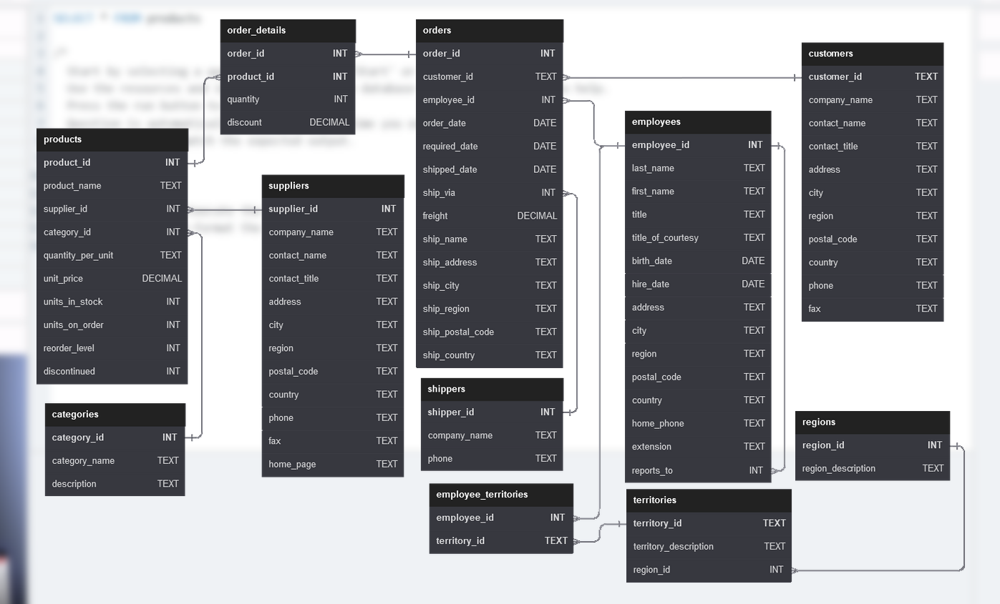

# Northwind-SQL-70

## About the Project
This is my **second SQL project**.
I solved all **15 practice questions** from [sql-practice.com](https://www.sql-practice.com/) plus additional 55 extra questions using the **Northwind database**.  

It helped me strengthen real SQL skills like JOINs, GROUP BY and more — all through Northwind data (products, customers, orders, employees, and shipping logistics)."

## Files in this Repository
- `Northwind Queries.sql` ← All 70 questions + my solutions (main file)
- `schema.png` ← Database schema diagram
- `README.md` ← This file

## Database Schema

**Note**: You can use the Northwind database from sql-practice.com if you want to practice by yourself.

## Author
**Kabir Kharadi**  
Second SQL Project | Learning Business Analysis  

---
